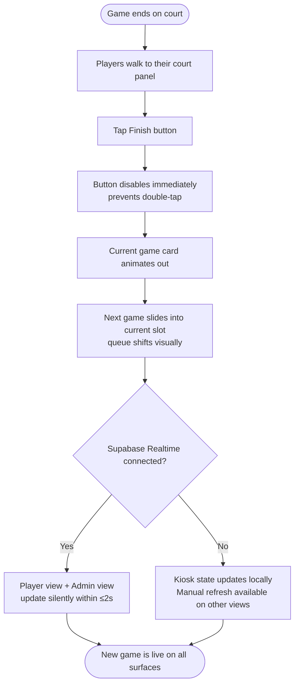
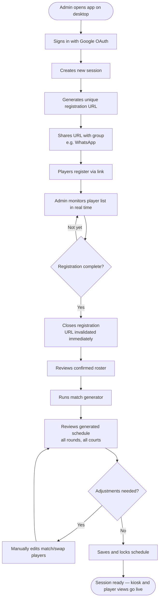
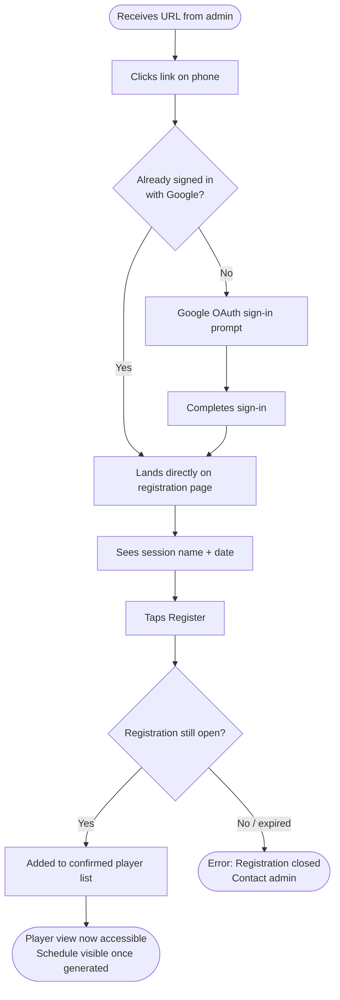
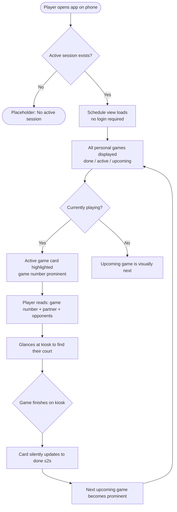
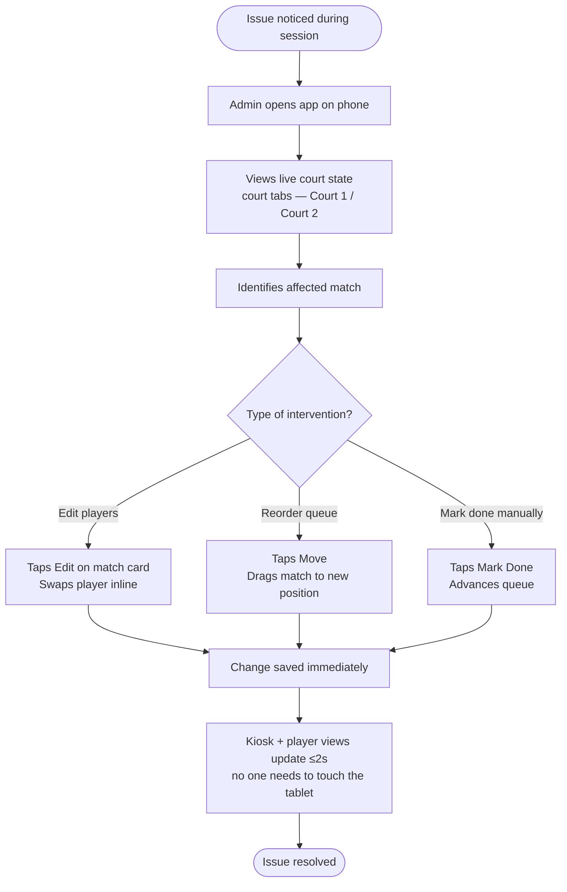

# UX Design Specification badminton_v2

**Author:** Wes
**Date:** 2026-03-18

---

<!-- UX design content will be appended sequentially through collaborative workflow steps -->

## Executive Summary

### Project Vision

badminton_v2 is a React + Supabase SPA that replaces a Streamlit scheduling tool with three purpose-built, role-separated views sharing live data via Supabase Realtime. The UX challenge is serving radically different audiences (Admin, Player, Kiosk) across different devices and contexts, unified by a clean design language anchored in #9C51B6.

### Target Users

| Role | Device | Auth | Primary Need |
|---|---|---|---|
| Admin | Desktop (pre-session) / Mobile (day-of) | Google OAuth | Manage sessions end-to-end |
| Player | Mobile phone | None (public) | Find their games quickly |
| Kiosk | Tablet landscape | None (public) | Show live court state; accept Finish taps |

### Key Design Challenges

- **Three-device split:** Admin desktop, player mobile, and kiosk tablet each require purpose-built layouts — responsive one-size design is insufficient.
- **Kiosk glanceability:** Court state must be readable from across the room — demands large typography, minimal chrome, and high contrast.
- **Admin context switch:** Same user, two modes — careful desktop session setup vs. quick mobile queue intervention during play.

### Design Opportunities

- **Brand moment via #9C51B6:** A confident purple with clean white/dark surfaces creates a premium feel distinct from utility apps.
- **Game number as UX anchor:** The shared reference between player view and kiosk — making it the visual hero on both surfaces creates instant orientation.
- **Zero-friction player entry:** Public player view with no login means first-load experience can be immediate and direct.

## Core User Experience

### Defining Experience

The defining interaction of badminton_v2 is the **Finish button** on the kiosk. When tapped, all three views — kiosk, player, admin — update simultaneously within ≤2 seconds. This single moment proves the system works and is the v1 failure v2 fixes.

Each role has a primary action that defines their experience:
- **Kiosk:** Tap Finish when a game ends → court queue advances
- **Player:** Land on schedule, instantly see next game + matchup (no login)
- **Admin:** Generate full session schedule in one action; intervene only if needed

### Platform Strategy

React SPA on web across three device contexts:
- **Admin pre-session:** Desktop browser — full schedule visibility, keyboard/mouse
- **Admin day-of:** Mobile browser — targeted queue interventions, touch
- **Player view:** Mobile browser — public, no auth, fast first load
- **Kiosk:** Landscape tablet browser — public, single-purpose, touch

No native app required. No offline mode required.

### Effortless Interactions

- **Player entry:** No login, no redirect — land directly on personal schedule
- **Kiosk Finish:** Single large tap target — the only interactive element players need to locate
- **Real-time updates:** Silent, automatic — no pull-to-refresh, no manual action
- **Match generation:** One button → full schedule for 10–30 players across all courts

### Critical Success Moments

- Admin generates schedule → all courts populated, zero manual adjustments needed
- Kiosk updates automatically after Finish tap without anyone touching it (v1 fix)
- Player finds their next game in under 3 seconds on mobile
- Admin edits a queue on mobile → kiosk reflects change within 2 seconds

### Experience Principles

1. **Each view does one job** — no role sees another role's controls or noise
2. **Game number is the universal anchor** — hero-sized on kiosk and player view
3. **Real-time is invisible** — updates arrive silently; interface reflects current state
4. **Admin power, zero ceremony** — schedule generation is one action; day-of fixes are 2 taps

## Desired Emotional Response

### Primary Emotional Goals

- **Players:** "I'm ready" — instant orientation to their game, zero effort
- **Kiosk users:** "I trust what I'm seeing" — the display is authoritative
- **Admin:** "I'm in control" — the session runs itself; intervention is a choice, not a necessity

### Emotional Journey Mapping

| Stage | Desired Feeling | Avoid |
|---|---|---|
| First load (player) | Instant orientation — "this is mine" | Confusion, "where do I go?" |
| During session (kiosk) | Calm confidence — "the screen is right" | Doubt, "is this up to date?" |
| Admin setup | Competence — "I built this session" | Anxiety, "did that save?" |
| Admin day-of | Control — "I can fix anything from my phone" | Helplessness, "I need the tablet" |
| Real-time update | Invisible — zero emotion (it just works) | Jarring flash or disruption |

### Micro-Emotions

- **Trust over delight** — used weekly by the same group; reliability matters more than novelty
- **Confidence over excitement** — players are focused on playing, not the app
- **Accomplishment (admin)** — running a clean session end-to-end feels like hosting done right

### Design Implications

- **Trust** → live data indicator; visual distinction between current game and queued game
- **Confidence** → game number as hero element — large, unambiguous, impossible to miss
- **Control** → every admin action has immediate visible feedback; no silent failures
- **Invisible real-time** → updates animate subtly (slide/fade), never flash or disrupt reading

### Emotional Design Principles

1. **Reliability is the emotion** — trust is earned by the app never being wrong or stale
2. **Clarity before aesthetics** — if a player has to think, the design failed
3. **Silent updates, visible state** — the transition is invisible; the result is unmistakable
4. **Admin feedback is immediate** — every save, every change confirms itself visually

## UX Pattern Analysis & Inspiration

### Inspiring Products Analysis

**Challonge / Smash.gg** — tournament bracket management
- Game number as primary navigation anchor
- Status chips (In Progress / Up Next / Complete) reduce cognitive load
- Past rounds recede visually; current round is dominant

**Linear** — action-oriented SPA
- Instant visual feedback on every admin action
- In-place state animation — no page reload feel
- Desktop: list + detail split for schedule management

**Airport/transit departure boards** — ambient kiosk display
- High contrast, large text, readable at distance
- Two-column parallel queue display (direct Court 1 | Court 2 analogue)
- Status column carries all the meaning per row

**Google Sign-In** — OAuth entry point
- Single button, zero form fields, trusted brand mark
- "Continue as [Name]" removes re-auth friction

### Transferable UX Patterns

| Pattern | Source | Apply To |
|---|---|---|
| Status chip (current / next / done) | Challonge | Kiosk court panels + player game list |
| In-place state animation | Linear | All real-time updates — slide up, don't flash |
| Two-column parallel display | Departure boards | Kiosk (Court 1 \| Court 2) |
| Hero number + minimal metadata | Departure boards | Game number large, partner/opponents smaller |
| Single-action OAuth button | Google Sign-In | Player registration entry point |
| List + detail desktop split | Linear | Admin schedule view |

### Anti-Patterns to Avoid

- **Distinct-URL role separation violated** — tab bars for role switching risk wrong-role landings
- **Modal chains for admin actions** — day-of interventions need inline edits, not dialog stacks
- **Auto-scroll on real-time updates** — position jumps disorient kiosk readers; animate in-place
- **Toast notifications on kiosk** — ambient display has no notification recipient; creates noise

### Design Inspiration Strategy

**Adopt:**
- Departure board two-column layout and status hierarchy for kiosk
- Linear-style in-place animation for all real-time state changes

**Adapt:**
- Challonge status chips → 3-state system (Playing / Up Next / Queued) with #9C51B6 as the active/current state colour

**Avoid:**
- Any kiosk pattern requiring sustained user attention beyond reading and tapping Finish

## Design System Foundation

### Design System Choice

**shadcn/ui + Tailwind CSS**

Copy-paste component architecture built on Radix UI primitives, styled with Tailwind utility classes. Components live in the project codebase — no external library lock-in.

### Rationale for Selection

- **Solo dev velocity:** Components are copied directly into the project; no fighting library defaults or overriding CSS specificity battles
- **Full layout control:** Tailwind utility classes give complete freedom for the kiosk's landscape two-panel layout and large-type display requirements
- **Clean theming:** #9C51B6 maps to a single CSS variable (`--primary`) applied globally — no Material Design or Ant Design aesthetic to override
- **React ecosystem fit:** First-class Vite + React support; smallest viable bundle (only ship components actually used)

### Implementation Approach

- Base: shadcn/ui component library initialised with neutral theme
- Styling: Tailwind CSS utility classes for layout; CSS variables for brand tokens
- Icons: Lucide React (bundled with shadcn/ui)
- Fonts: System font stack for performance; no web font loading on kiosk

### Customisation Strategy

**Brand tokens:**
- `--primary: #9C51B6` — active state, current game, primary actions
- `--primary-foreground: #ffffff` — text on primary backgrounds
- `--muted` — Up Next / queued state (neutral)

**Game status colour system:**
- Playing → `primary` (#9C51B6) — the court is live
- Up Next → `muted-foreground` — visible but not competing
- Queued → `muted` — recedes into background

**Kiosk-specific:**
- Dark surface variant (dark background, white text) for maximum readability at distance
- Game number typography: 4–6rem bold — hero element on both kiosk and player view
- Finish button: full-width, large tap target, `primary` colour

## Design Direction Decision

### Design Directions Explored

Seven mockups explored across three views:
- Kiosk: Dark Minimal (A), Purple Court Headers (B), Split Cards (C)
- Player: Purple Header + Cards (A), Minimal List (B)
- Admin: Desktop Sidebar (A), Mobile Day-of (B)

### Chosen Direction

| View | Direction | Rationale |
|---|---|---|
| Kiosk | C — Split Cards | Each court is a visually distinct card with 4rem game number hero and maximum whitespace — most readable at distance on tablet |
| Player | A — Purple Header + Cards | Purple identity header establishes the view; card-based layout with tinted active game gives clear status hierarchy on mobile |
| Admin | Both A + B | Desktop Sidebar for pre-session setup (full schedule visibility); Mobile Day-of for session intervention (court tabs, inline quick actions) |

### Design Rationale

- **Kiosk Split Cards:** The card boundary between Court 1 and Court 2 creates physical separation — players approach the correct panel without confusion. The 4rem game number at this scale is readable from 3–4 metres. Full-card layout over minimal rows prioritises ambient readability over information density.
- **Player Purple Header:** The `#9C51B6` header immediately identifies "this is your session view." Card-based status (done / active / queued) is faster to scan than a minimal list when a player checks mid-session.
- **Admin dual layouts:** The same admin user operates in two modes — deliberate desktop setup and reactive mobile triage. Both layouts are needed; they share the same data model and real-time connection.

### Implementation Approach

- Kiosk: Full-viewport React component, dark CSS theme, two `<CourtCard>` components side by side, Finish button at card bottom
- Player: `<PlayerHeader>` + `<GameList>` with per-card status variants (done / active / queued)
- Admin desktop: App shell with `<ScheduleSidebar>` + `<MatchDetail>` panel
- Admin mobile: `<CourtTabs>` + `<MatchCardMobile>` with inline action buttons
- Shared: `useRealtimeSync` hook — all views subscribe to same Supabase channel

## User Journey Flows

### Flow 1: Kiosk — Finish Game (Defining Interaction)

### Flow 2: Admin — Pre-Session Setup

### Flow 3: Player — Registration via OAuth URL

### Flow 4: Player — Personal View During Session

### Flow 5: Admin — Day-of Intervention (Mobile)

### Journey Patterns

**Navigation:** All views are distinct URLs — no shared chrome. Players land directly on their view; no role-switching UI needed.

**Feedback:** Every state-changing action (Finish, Register, Save schedule, Mark Done) disables the trigger immediately and confirms with a visual state change — no silent failures.

**Real-time fallback:** All flows involving live data have a graceful degradation path (manual refresh) — the session never stops because Realtime is unavailable.

**Error recovery:** Registration errors show a clear message; admin is the recovery path. Schedule edits are inline, not modal — two taps maximum for any day-of fix.

### Flow Optimization Principles

1. **Minimum steps to value** — Player opens app → sees their schedule in one load, zero navigation
2. **Disable before confirm** — Action triggers disable immediately; feedback comes from state change, not toast
3. **Failure never blocks the session** — Every realtime path has a manual fallback; kiosk is always operable
4. **Admin mobile = triage, not setup** — Mobile flows expose only intervention actions; full schedule editing stays on desktop

## Component Strategy

### Design System Components (shadcn/ui — available out of box)

Button, Card, Badge, Tabs, Input, Select, Dialog, Sheet, Skeleton, Separator, Dropdown Menu — covers all standard admin form controls, navigation, and layout primitives.

### Custom Components

#### `<CourtCard>` — Kiosk court panel
**Purpose:** Full-height dark card representing one physical court. Contains current game, next game, and Finish button.
**States:** `live` (primary border, active game highlighted), `idle` (no current game — between rounds)
**Key behaviour:** Finish button disables on tap and re-enables only after server confirmation. Never allows double-tap.

#### `<GameCard>` — Player view game card
**Purpose:** Single game in a player's personal schedule with status-driven visual variants.
**States:** `done` (muted opacity, strikethrough, success checkmark), `active` (primary-subtle tint, prominent hero number), `queued` (neutral, recedes visually)
**Content:** Game number (hero size), partner name, vs opponents. Read-only — no user actions.

#### `<StatusChip>` — Game status label
**Purpose:** Inline 3-state status indicator: Playing / Up Next / Queued / Done.
**Base:** shadcn Badge with custom colour variants mapping to `primary`, `muted`, `muted-surface`, `success`.

#### `<LiveIndicator>` — Realtime connection status
**Purpose:** Pulsing dot showing Supabase Realtime connection state. Hidden when connected; visible only when degraded.
**States:** `connected` (hidden), `reconnecting` (amber pulse), `fallback` (grey — manual refresh mode)
**Placement:** Top corner of kiosk and player view.

#### `<PlayerScheduleHeader>` — Player view identity bar
**Purpose:** Purple header establishing player identity — player name, session name, game count. Static once loaded.

#### `<RegistrationURLCard>` — Admin registration panel
**Purpose:** Displays active registration URL with copy button and player count. Exposes open/close toggle.
**States:** `open` (URL visible, live player count, copy button), `closed` (URL invalidated message)
**Key behaviour:** Close Registration is destructive — requires confirm dialog before invalidating URL.

#### `<MatchGeneratorPanel>` — Admin schedule builder
**Purpose:** Three-stage flow: roster list → generated schedule preview → locked schedule.
**States:** `pre-generate` (roster + Generate button), `preview` (editable schedule table + Save), `locked` (read-only)
**Key behaviour:** Lock is irreversible — confirm dialog required. Preview allows inline edits before locking.

#### `<CourtTabs>` — Admin mobile court switcher
**Purpose:** Two-tab switcher (Court 1 / Court 2) on admin mobile view.
**Base:** shadcn Tabs with primary active indicator. Remembers scroll position per court.

### Component Implementation Strategy

- All custom components use design tokens (`--primary`, `--muted`, `--success`) — no hardcoded hex values in components
- shadcn/ui components used as structural primitives; custom components add domain-specific behaviour on top
- Kiosk components use dark theme CSS class applied at root — all tokens override to dark palette
- Realtime state managed via shared `useRealtimeSync` hook; components receive state as props only

### Implementation Roadmap

| Phase | Components | Enables |
|---|---|---|
| Phase 1 — MVP | `<GameCard>`, `<PlayerScheduleHeader>`, `<StatusChip>`, `<LiveIndicator>` | Player view + basic match display |
| Phase 2 — Full app | `<CourtCard>`, `<RegistrationURLCard>`, `<MatchGeneratorPanel>`, `<CourtTabs>` | Kiosk, admin setup, registration |
| Phase 3 — Stats | Stats charts (Recharts), attendance history list | Stats & attendance views |

## UX Consistency Patterns

### Button Hierarchy

| Level | Variant | Use |
|---|---|---|
| Primary | `primary` fill | One per screen: Generate, Save, Register, Finish |
| Secondary | `outline` | Supporting: Edit, Move, Copy URL |
| Ghost | `ghost` | Low-emphasis: Cancel, dismiss |
| Destructive | `destructive` outline | Irreversible: Close Registration, Lock Schedule |

**Rule:** One primary action per screen — never two primary buttons competing.

### Feedback Patterns

| Situation | Pattern |
|---|---|
| Action registered | Immediate element state change — button disables or changes label. No toast. |
| Real-time update received | Silent in-place animation (slide/fade). No toast, no alert. |
| Realtime degraded | `<LiveIndicator>` amber pulse. No modal interrupt — session continues. |
| Destructive confirm | Button label changes to "Confirm [Action]?" on first tap, executes on second tap within 5s. |
| URL copied | Button label shows "Copied!" for 2s, reverts. No toast. |
| Error state | Inline error text below action — red, no icon. |

**Rule:** No toasts on kiosk. Ambient display — notifications have no recipient.

### Navigation Patterns

- Routes are role-separated: `/kiosk`, `/player/:playerId`, `/admin`
- No shared navigation chrome — each route is a full-viewport layout
- No in-app role-switching — users land on their correct route directly
- Admin desktop and mobile share `/admin` — responsive layout handles the difference

### Loading & Empty States

| State | Pattern |
|---|---|
| Player schedule loading | Skeleton game cards (3 placeholders matching final layout) |
| No active session | Centred message: "No active session" — no illustration |
| All games complete | Court card shows "Session complete" — Finish button hidden |
| Admin roster loading | Skeleton list rows in sidebar |

### Destructive Action Pattern

Used for: Close Registration, Lock Schedule.

1. Button renders as `destructive outline`
2. First tap → label changes to "Confirm [Action]?" with 5s auto-cancel countdown
3. Second tap within 5s → executes action
4. Tap elsewhere → cancels, button reverts

No modals — mobile-friendly, no focus trap required.

### Form Patterns

- Validation: inline, on blur — no submit-time error flash
- Save: always explicit button tap, never auto-save
- Cancel: ghost button — no confirm unless unsaved changes exist
- Inputs: shadcn `Input` / `Select` with `--primary` focus ring

## Responsive Design & Accessibility

### Responsive Strategy

badminton_v2 uses purpose-built layouts per role, not a single adaptive layout:

| View | Target | Layout |
|---|---|---|
| Player | Mobile portrait (360–430px) | Single column, 16px padding, vertical card stack |
| Admin pre-session | Desktop (1024px+) | 2-column: 280px sidebar + fluid content |
| Admin day-of | Mobile portrait | Single column, bottom-anchored action bar |
| Kiosk | Tablet landscape (768–1366px) | Fixed 50/50 viewport split, no scroll |

Kiosk must be landscape. Portrait orientation shows a "Please rotate your device" overlay.

### Breakpoint Strategy

Tailwind defaults — no custom breakpoints required:

| Token | Width | Purpose |
|---|---|---|
| `md` | 768px | Admin layout switch (single → 2-column) |
| `lg` | 1024px | Admin sidebar becomes permanent |

Mobile-first: all views start as single-column; `md`/`lg` breakpoints add complexity.

### Accessibility Strategy

No WCAG compliance required (private tool, known user base). Practical minimums:

| Concern | Implementation |
|---|---|
| Touch targets | Minimum 48×48px; kiosk Finish button is full-width |
| Colour contrast | Primary on white passes AA for large text; kiosk dark mode exceeds AA |
| Focus indicators | shadcn/ui `--ring` style retained on all interactive elements |
| Keyboard navigation | Admin forms: tab order follows visual layout; kiosk is touch-only |
| Font legibility | System font stack — renders at native resolution on all devices |

### Testing Strategy

| Surface | Method |
|---|---|
| Player view | Physical mobile (Chrome Android + Safari iOS) |
| Kiosk | Physical tablet or devtools at 1024×768 landscape |
| Admin desktop | Chrome, Firefox, Safari at standard desktop widths |
| Realtime fallback | Block Supabase temporarily — verify `<LiveIndicator>` activates and session continues uninterrupted |

### Implementation Guidelines

- Typography: `rem` units; borders and hairlines only in `px`
- Kiosk root: `h-screen w-screen overflow-hidden` — no scroll ever
- Player/admin mobile: `min-h-screen` with natural vertical scroll
- Admin sidebar: `w-[280px] shrink-0` + `flex-1 overflow-y-auto` for content pane
- Kiosk orientation guard: check `screen.orientation.type` on mount; show rotate overlay if portrait

## 2. Core User Experience

### 2.1 Defining Experience

> "Tap Finish on the court — the queue advances everywhere, instantly."

The defining interaction of badminton_v2 is the Finish button on the kiosk. When tapped, all three views update simultaneously within ≤2 seconds — without anyone touching anything else. This is the v1 failure v2 fixes, and the single moment that proves the system works.

### 2.2 User Mental Model

Players bring a scoreboard/departure-board mental model: the number on the display is the truth. When they see Game 7 on the kiosk, that's where they go. When it changes to Game 8, Game 7 is done. v1 broke this model by allowing the kiosk to go stale. v2 restores it by making the display reliably current at all times.

### 2.3 Success Criteria

- Finish tapped → kiosk state changes within ≤2 seconds, no manual refresh needed
- New "current game" is immediately visually dominant after transition
- Completing game animates out; next game slides in — transition communicates the action
- If real-time fails, kiosk continues via manual refresh — session never stops

### 2.4 Novel UX Patterns

The queue advancement model is entirely established (scoreboards, departure boards, ticket queues). The novel element is **bidirectional multi-view sync** — one Finish action updates three surfaces simultaneously. Users need only trust it works; no education required.

Familiar metaphor: departure board. Novel layer: any view on any device reflects the same state within 2 seconds of any change.

### 2.5 Experience Mechanics

**Finish Flow:**

| Step | What happens |
|---|---|
| Initiation | Game ends; players walk to kiosk panel for their court |
| Interaction | Tap the large Finish button on their court's panel |
| Feedback | Button disables immediately (prevents double-tap); current game card animates out |
| Propagation | Next game slides into "current" slot on kiosk; player + admin views update silently |
| Completion | New current game displayed prominently; full queue shifts visually |

## Visual Design Foundation

### Color System

**Light mode (Player view, Admin):**

| Token | Value | Use |
|---|---|---|
| `--primary` | `#9C51B6` | Active game, primary actions, CTA buttons |
| `--primary-hover` | `#B472CC` | Button hover state |
| `--primary-pressed` | `#7A3D8E` | Button pressed/active |
| `--primary-subtle` | `#F0E6F7` | Background tint on active game cards |
| `--success` | `#22C55E` | Completed game indicator |
| `--muted` | `#6B7280` | Up Next / queued state |
| `--muted-surface` | `#F4F4F6` | Card backgrounds, secondary surfaces |
| `--border` | `#E4E4E7` | Card borders, dividers |
| `--foreground` | `#18181B` | Primary text |
| `--background` | `#FFFFFF` | Page background |

**Kiosk dark mode (maximum readability at distance):**

| Token | Value |
|---|---|
| `--background` | `#0F0F17` |
| `--surface` | `#1C1C28` |
| `--border` | `#2E2E3E` |
| `--foreground` | `#F4F4F6` |
| `--primary` | `#B472CC` (brightened for dark surface) |

**Game status colour mapping:**
- Playing (current) → `primary` (#9C51B6 / #B472CC on kiosk)
- Up Next → `muted-foreground` — visible, not competing
- Queued → `muted` — recedes into background
- Completed → `success` (#22C55E) with strikethrough

### Typography System

**Font:** Inter (system-ui fallback) — no web font loading on kiosk

| Scale | Size | Weight | Use |
|---|---|---|---|
| `game-hero` | 4–6rem | 700 | Game number on kiosk + player view |
| `h1` | 1.875rem | 700 | Page titles |
| `h2` | 1.5rem | 600 | Section headers, court labels |
| `h3` | 1.25rem | 600 | Card titles, player names |
| `body` | 1rem | 400 | General content |
| `small` | 0.875rem | 400 | Secondary metadata |
| `label` | 0.75rem | 500 | Status chips, badges |

### Spacing & Layout Foundation

**Base unit:** 4px (Tailwind default); component spacing in 8px increments

| View | Layout |
|---|---|
| Kiosk | 50/50 landscape split, full viewport height, no nav chrome |
| Player (mobile) | Single column, 16px padding, game cards stacked vertically |
| Admin desktop | 2-column: 320px sidebar (schedule list) + main content |
| Admin mobile | Single column, bottom-anchored action bar |

### Accessibility Considerations

No WCAG compliance required per PRD. Practical minimums applied:
- Primary (#9C51B6) on white passes AA for large text (≥18px)
- Kiosk dark mode: white on #0F0F17 exceeds AA at all sizes
- Finish button minimum tap target: 48×48px
