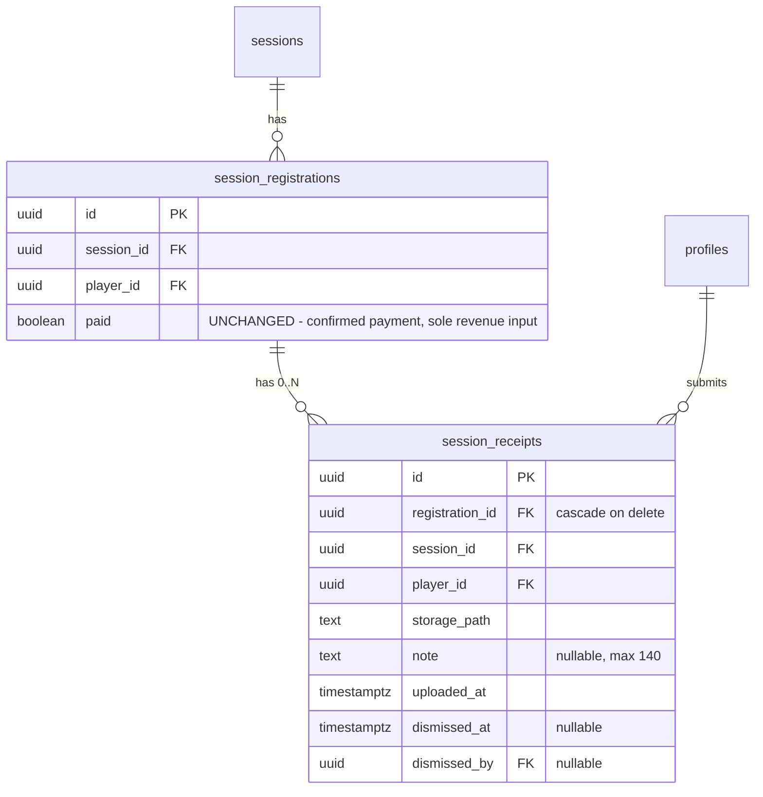
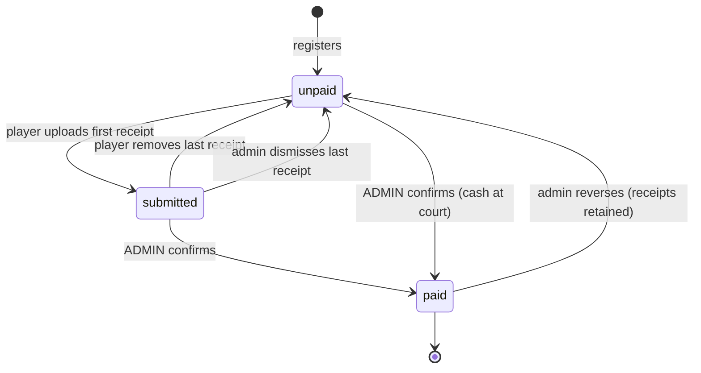

# Phase 1 Data Model: Payment Receipt Upload & Admin Receipt Review

**Feature**: `005-payment-receipt-upload` | **Date**: 2026-08-27

---

## Entity overview



---

## 1. `session_receipts` (new table)

One row per payment proof submitted. Append-only from the player's perspective; an administrator may dismiss but does not edit content.

| Column | Type | Constraints | Purpose |
|--------|------|-------------|---------|
| `id` | `UUID` | PK, `DEFAULT gen_random_uuid()` | Also names the stored image file |
| `registration_id` | `UUID` | `NOT NULL`, FK → `session_registrations(id)` `ON DELETE CASCADE` | Owning registration; cascade satisfies FR-031 at row level |
| `session_id` | `UUID` | `NOT NULL`, FK → `sessions(id)` `ON DELETE CASCADE` | Denormalised so a session's receipts are one query (R4, R9) |
| `player_id` | `UUID` | `NOT NULL`, FK → `profiles(id)` `ON DELETE CASCADE` | Denormalised for RLS without a join |
| `storage_path` | `TEXT` | `NOT NULL` | Exact object path; the only record of where the image lives (R4) |
| `note` | `TEXT` | `NULL`, `CHECK (note IS NULL OR char_length(note) <= 140)` | FR-003, FR-004 |
| `uploaded_at` | `TIMESTAMPTZ` | `NOT NULL DEFAULT now()` | FR-023 |
| `dismissed_at` | `TIMESTAMPTZ` | `NULL` | FR-027; `NULL` means active |
| `dismissed_by` | `UUID` | `NULL`, FK → `auth.users(id)` `ON DELETE SET NULL` | Audit trail, matching `payment_settings.updated_by` in `073` |

### Why both `registration_id` and (`session_id`, `player_id`)

`registration_id` is the true parent and carries the cascade. The other two are denormalised so RLS predicates and the three read paths in R9 need no join. They are kept honest by a trigger-free invariant: the client always derives all three from the same registration row it just read, and `ON DELETE CASCADE` from either parent removes the row regardless of which one goes first.

### Indexes

| Index | Columns | Serves |
|-------|---------|--------|
| `idx_session_receipts_session` | `(session_id)` | Admin panel fetch, session cleanup (R4, R9) |
| `idx_session_receipts_player_session` | `(player_id, session_id)` | Player's own receipts on their session card |
| `idx_session_receipts_registration` | `(registration_id)` | Cascade performance |

### Constraints beyond column level

- No uniqueness on `(player_id, session_id)` — multiple receipts are the point (FR-008).
- No de-duplication of identical images — explicitly declared out of scope in the spec's edge cases.
- The per-session receipt ceiling is **not** a database constraint. Per R8 it is a client-side courtesy limit; enforcing it in RLS would require a counting subquery on every insert to guard against a user storing a few extra of their own images.

---

## 2. `session_registrations` (existing — unchanged)

**No schema change.** `paid BOOLEAN NOT NULL DEFAULT false` (migration `042`) keeps its exact current meaning and remains the only input to revenue in `get_session_finance` (`074:53`).

This is the load-bearing decision of the whole feature. It is what makes FR-034 and SC-004 true by construction rather than by careful patching, and what makes FR-033 automatic — every pre-existing registration has zero receipts and therefore derives to exactly the state it shows today.

Gains an inbound relationship: zero or more `session_receipts`.

---

## 3. Payment State (derived — never stored)

A pure function, not a column:

```ts
type PaymentState = 'unpaid' | 'submitted' | 'paid'

derivePaymentState({ paid, activeReceiptCount }): PaymentState
```

| `paid` | `activeReceiptCount` | State | Colour | Requirement |
|--------|---------------------|-------|--------|-------------|
| `true` | any | `paid` | green | FR-018 |
| `false` / `null` | `> 0` | `submitted` | orange | FR-017 |
| `false` / `null` | `0` | `unpaid` | red | FR-019 |

`activeReceiptCount` counts only rows where `dismissed_at IS NULL`.

`paid` is `NOT NULL` in the database, but the player-side read path already types it `boolean | null` for the not-registered case (`SessionPlayerDetailView.tsx:22`), and the existing test suite pins null-as-unpaid behaviour. The helper preserves that.

### State transitions



Only the two transitions marked ADMIN write to `paid`. Every other transition is a consequence of the receipt set changing — nothing is persisted, so no transition can leave the two out of sync.

Note `paid → unpaid` retains receipts (US2 scenario 6), which is why reversal lands on `unpaid` in the diagram but renders as `submitted` if active receipts still exist — the derivation, not the transition, decides.

---

## 4. Storage object

**Bucket**: `receipts`, `public = false` — the first private bucket in this codebase.

**Path**: `{player_id}/{session_id}/{receipt_id}.jpg`

`player_id` leads so the ownership predicate stays `(storage.foldername(name))[1] = auth.uid()::text`, identical to `069_add_profile_avatars.sql` (R3).

**Format**: always `image/jpeg` after client-side resize. Limits: max dimension 1600 px, max stored 800 KB, max accepted input 20 MB (R5).

**Lifecycle**: written before its row, deleted before its row, at all three call sites (R4) — player deletes own, administrator removes a player from the roster, administrator deletes a session. The latter two are cascade-driven and therefore silent if missed. No `upsert` — each receipt is a distinct object under a fresh UUID, so an interrupted retry can never overwrite an existing receipt.

---

## 5. Access control

### `session_receipts` RLS

| Operation | Who | Predicate |
|-----------|-----|-----------|
| SELECT | Player | `player_id = auth.uid()` |
| SELECT | Admin | `role = 'admin'` |
| INSERT | Player | `player_id = auth.uid()` **AND** parent registration's `paid = false` |
| DELETE | Player | `player_id = auth.uid()` **AND** parent registration's `paid = false` |
| DELETE | Admin | *No policy.* Administrators dismiss (FR-027), never delete rows — retention is required by FR-032, and rows go only by cascade |
| UPDATE | Admin only | `role = 'admin'` — dismissal only |

The parent-`paid` subquery on INSERT and DELETE is what actually closes the stale-form race in the spec's edge cases: it reads the registration's current value at write time, so a form opened before confirmation cannot write after it.

Moderators match no policy and therefore see zero rows — this is the enforcement FR-021 requires, since `AdminRoute` (`src/App.tsx:28`) admits them to `/finance` (R7).

### `storage.objects` RLS for `receipts`

| Operation | Predicate |
|-----------|-----------|
| SELECT | own first path segment **OR** `role = 'admin'` |
| INSERT | own first path segment |
| DELETE | own first path segment **OR** `role = 'admin'` — the admin arm is required, since removing a player or a session means deleting *another* player's files |
| UPDATE | none — objects are immutable |

No public read policy. This is the deliberate departure from `avatars` and `payment-qr`, and the reason `getPublicUrl()` must not appear anywhere in this feature.

### Realtime

`session_receipts` added to the `supabase_realtime` publication with `REPLICA IDENTITY FULL`, following `072` (R6). Realtime applies RLS, so administrators receive every event and players receive only their own.

---

## 6. TypeScript types

`src/types/database.ts` gains a `session_receipts` entry with `Row` / `Insert` / `Update` and its three relationships, matching the generated shape of neighbouring tables. Per Constitution Principle II, this is mandatory whenever schema shape changes.

New hand-written types:

```ts
// src/lib/paymentState.ts
export type PaymentState = 'unpaid' | 'submitted' | 'paid'

// src/hooks/useSessionReceipts.ts
export interface SessionReceipt {
  id: string
  playerId: string
  sessionId: string
  storagePath: string
  note: string | null
  uploadedAt: string
  dismissedAt: string | null
}
```

`RosterPlayer` (`src/hooks/useRoster.ts:5`) gains `activeReceiptCount: number`; its `paid: boolean` field is unchanged.

---

## 7. Migrations

Additive only, per the constitution's additive-first rule. Latest on disk is `074`, so:

| File | Contents |
|------|----------|
| `075_create_session_receipts.sql` | Table, indexes, RLS enable, five policies, grants |
| `076_create_receipts_bucket.sql` | Private bucket + four `storage.objects` policies |
| `077_session_receipts_realtime.sql` | `REPLICA IDENTITY FULL` + guarded publication add, mirroring `072` |

No `ALTER` on any existing table. No backfill. No change to `get_session_finance`. Rolling back is dropping three objects, and every pre-existing row behaves identically with them present or absent.
